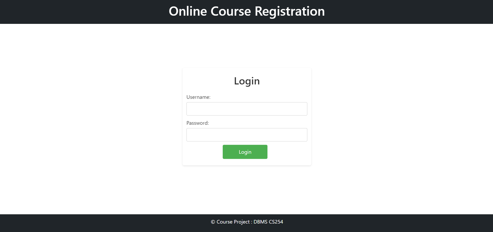

# Course-Registration-Prj
This project is a web-based course registration system designed to facilitate the process of course enrollment for students and management by administrators.
# Features
1. Three dashboards: Student,Teacher, Admin
2. Student registration
3. Offered courses and enrolled courses
4. Efficient course management through Admin dashboard.

